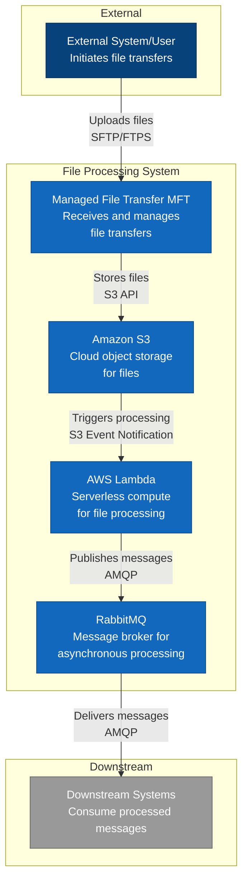

# C4 Context Diagram - File Transfer and Processing System

## Architecture Overview

This C4 Context diagram shows the high-level architecture of a file transfer and processing system.

### Data Flow

1. **External System/User** → **MFT**: Files are uploaded via SFTP/FTPS
2. **MFT** → **S3**: Files are stored in Amazon S3 using S3 API
3. **S3** → **Lambda**: S3 event notifications trigger Lambda functions
4. **Lambda** → **RabbitMQ**: Processed data is published as messages via AMQP
5. **RabbitMQ** → **Downstream Systems**: Messages are delivered to consumers

### Components

| Component | Type | Description |
|-----------|------|-------------|
| External System/User | External Actor | Initiates file transfers via MFT |
| Managed File Transfer (MFT) | System | Secure file transfer gateway |
| Amazon S3 | System | Cloud object storage service |
| AWS Lambda | System | Serverless compute for processing |
| RabbitMQ | System | Message broker for async processing |
| Downstream Systems | External System | Consume processed messages |

### Key Benefits

- **Security**: MFT provides secure file transfer protocols
- **Scalability**: S3 and Lambda scale automatically
- **Reliability**: RabbitMQ ensures message delivery
- **Decoupling**: Event-driven architecture with loose coupling
- **Cost-effective**: Pay-per-use serverless model

## Viewing in GitHub

This diagram uses Mermaid syntax and will render automatically when viewed on GitHub. Simply push this file to your repository and view it on GitHub.

## Alternative Formats

For PlantUML version, see `c4-context-diagram.puml`